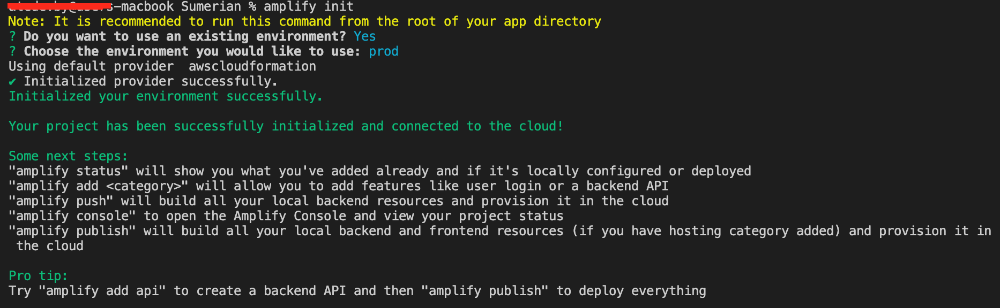
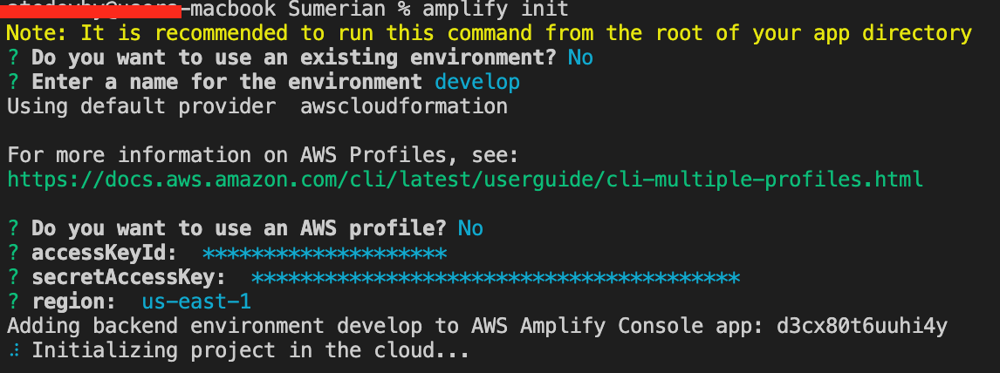

# App Sumerian

## Командная работа с Amplify

Для того, чтобы использовать контейнер, который уже есть, вам необходимо инициализировать контейнер. Но предварительно создайте отдельную ветку для работы над задачей и в ней выполните:
```sh
amplify init
```
После вам надо ответить на вопросы:
> ? Do you want to use an existing environment? // если есть контейнер с которым вам надо работать, то выбитаете `Yes` и там выбираете контейнер из существующих , если вам надо создать еще один контейнер, то выбираем `No` и там предлагается назвать контейнер, называете его.

Если вы ответили `YES`, то далее контейнер инициализировался с окружение, которое вы выбрали из существующих и можете работать.



Предварительно выполните:
```sh
apmlify pull
```
Если же вы ответили `NO`, то ниже вопросы и ответы



> ? Enter a name for the environment test // test примерное имя для демонстрации. То есть вам будет предложено ввести имя для окружения.
-------
> ? Choose your default editor: // предлагается список редакторов, которые вы используете. Вам надо выбрать тот, которым вы пользуетесь.

После всех ваших ответов происходит
**...Using default provider  awscloudformation**
и опять надо ответить на вопросы
> ? Do you want to use an AWS profile? // надо ответить `No` для того чтобы использовать IAM user
-------
> ? accessKeyId:  ********************* // данные находятся в `My security credentials`
-------
> ? secretAccessKey:  **************************************** // пароль дается один раз и так что когда создаете user, то созраните его. Если же всё таки вы пароль забыли/потеряли, то вы можете деактивировать `accessKeyId` и создать нового и там будет указан новые данные, включая пароль.
-------
> ? region:  us-east-1 // здесь выбираем ваш регион, регион вы можете посмотреть в aws.export.js

После чего у вас создаться контейнер с окружением.

Проверить какие у вас есть окружения, вы можете выполнив команду:
```sh
amplify env list
```
ваш контейнер будет помечен *
Пример
```sh
develop
test* // если есть звездочка, значит это текущее окружение
```

Более подробная информация по работе с Amplify здесь


Более подробная информация по работе с Amplify в команде [здесь](https://docs.amplify.aws/cli/teams/overview).